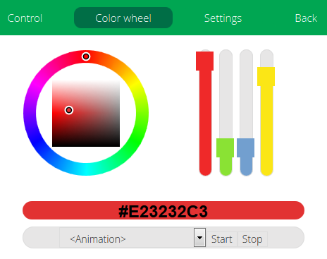

#  Vera-Plugin-RGBController

**Manage RGBW color channels and animation programs of Z-wave devices**

<br/>

 Designed for [Vera Control, Ltd.](http://getvera.com/) Home Controllers.

Compatible with
- Aeotec RGBW Bulb
- Fibaro FGRGB-101
- Qubino RGBW dimmer
- Sunricher RGBW Controller
- Zipato RGBW Bulb
- All Z-Wave device which supports COLOR COMMAND CLASS
- Hyperion (https://github.com/tvdzwan/hyperion/wiki)

<br/>
<br/>
<br/>

Designed for [Vera Control, Ltd.](http://getvera.com) Home Controllers (UI5 & UI7) and [openLuup](https://github.com/akbooer/openLuup).


## Installation

You will find the plugin on apps.mios.com or in "Apps->Install apps" by searching "RGB Controller".

In the "Settings" tab, select the type of the the device you want to control.

Then select its specific settings (the Z-Wave rgb device or server ip/port)

> **Just UI5**: There's no JSON decoder installed by default.
> If you have the error "No JSON decoder", you have to upload the library in "/usr/lib/lua". You can take "json.lua" or "dkjson.lua".
> You will find "json.lua" here : http://code.mios.com/trac/mios_genericutils/export/20/json.lua
>
> This code can be executed in "Apps->Develop apps->Test Luup code (Lua)"
> ```
> os.execute("wget -q -O /usr/lib/lua/json.lua http://code.mios.com/trac/mios_genericutils/export/20/json.lua")
> ```


## Usage

You can control your RGBW device :

1/ from the dashboard
It's just possible to switch ON or OFF the device (keeps the last chosen color).

2/ from "Color wheel" tab
You can
- Switch ON or OFF the device
- Set the RGB colors by the wheel or the sliders (RGB and white channels).
You can apply a transition between the current color and the new chosen color. You just have to set the duration of the transition and the number of steps. In any case, the plugin wil adjust these parameters in a way that the minimal duration between two intermediate changes is of one second.
- Start or stop animation programs if your device is compatible.

3/ by LUA script

- Switch on/off the RGBW device
```
-- switches ON the device
luup.call_action("urn:upnp-org:serviceId:SwitchPower1", "SetTarget", {newTargetValue = 1}, <idPlugin>)

-- switches OFF the device
luup.call_action("urn:upnp-org:serviceId:SwitchPower1", "SetTarget", {newTargetValue = 0}, <idPlugin>)
```

- Change the RGB color
```
-- sets the RGB color to red
luup.call_action("urn:upnp-org:serviceId:RGBController1", "SetColorTarget", {newColorTargetValue = "#FF0000"}, <idPlugin>)
```

- Change the RGBW color
```
-- sets the RGB color to red and the warm white to 100%
luup.call_action("urn:upnp-org:serviceId:RGBController1", "SetColorTarget", {newColorTargetValue = "#FF0000FF"}, <idPlugin>)

-- sets the RGB color to red and the cool white to 100%
luup.call_action("urn:upnp-org:serviceId:RGBController1", "SetColorTarget", {newColorTargetValue = "#FF000000FF"}, <idPlugin>)

-- sets the RGB color to blue and the cool white to 50%, with a transition of 30 seconds (in 10 steps)
luup.call_action("urn:upnp-org:serviceId:RGBController1", "SetColorTarget", {newColorTargetValue = "#0000FF007F", transitionDuration = 30, transitionNbSteps = 10}, <idPlugin>)
```

- Start an animation program
```
luup.call_action("urn:upnp-org:serviceId:RGBController1", "StartAnimationProgram", {programName = "LAPD"}, <idPlugin>)
```
You will find the animation program names in the "Color wheel" tab.

- Stop an animation program
```
luup.call_action("urn:upnp-org:serviceId:RGBController1", "StopAnimationProgram", {}, <idPlugin>)
```

4/ by scenes
You can achieve the same operations than by LUA script, in advanced editor of the scenes.


## Debug

You can enable the debug mode with setting the variable "Debug" to "1" in the "Advanced" panel.
Then, you can check the logs with this command (SSH session) :
```
tail -f /var/log/cmh/LuaUPnP.log | grep "^01\|RGBController"
```

## Inspirations

- the plugin jQuery Farbtastic

  https://github.com/mattfarina/farbtastic

- a merge of Farbtastic with jQueryUI sliders

  http://www.emanueleferonato.com/2011/03/22/jquery-color-picker-using-farbtastic-and-jquery-ui/


## Forums

- http://forum.micasaverde.com/index.php/topic,32613.0.html
- http://www.touteladomotique.com/forum/viewtopic.php?f=48&t=14736 (in French)
